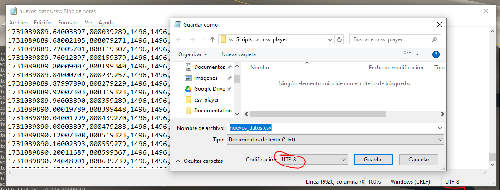

## Reproductor de entradas de radio en X-Plane

Script de Lua que reproduce los controles de radio a partir del .csv seleccionado.

### Como crear un .csv a partir de un registro .bin

#### Programas a instalar

1. Python 3.12

    https://www.python.org/downloads/

    En el instalador activar la opción de py launcher

2. pymavlink

    En el terminal o cmd

    ``py -3.12 -m pip install pymavlink``

#### Extraer datos

En la carpeta con el archivo mavlogdump.py

```
cd problema_complejo/kadet
py -3.12 mavlogdump.py --format "csv" --types "RCOU" "00000017.BIN" >> nuevos_datos.csv
```

Argumentos:

``--types "RCOU"`` para extraer solo los datos de radio.

``"00000017.BIN"`` archivo de entrada

``nuevos_datos.csv`` archivo de salida

### Instalar script lua

Copiar librería csv de la carpeta `Modules` a `Resources/plugins/FlyWithLua/Modules`

Copiar archivos de la carpeta `Scripts` a `Resources/plugins/FlyWithLua/Scripts`

### Reproducir archivo .csv

Copiar secuencia .csv a la carpeta `Resources/plugins/FlyWithLua/Scripts/csv_player`

Comenzar un vuelo en X-Plane e iniciar reproducción en el menú
```
Plugins -> FlyWithLua -> FlyWithLua Macros -> datos.csv
```

### No funciona

Verificar que el archivo .csv tenga codificación UTF-8

